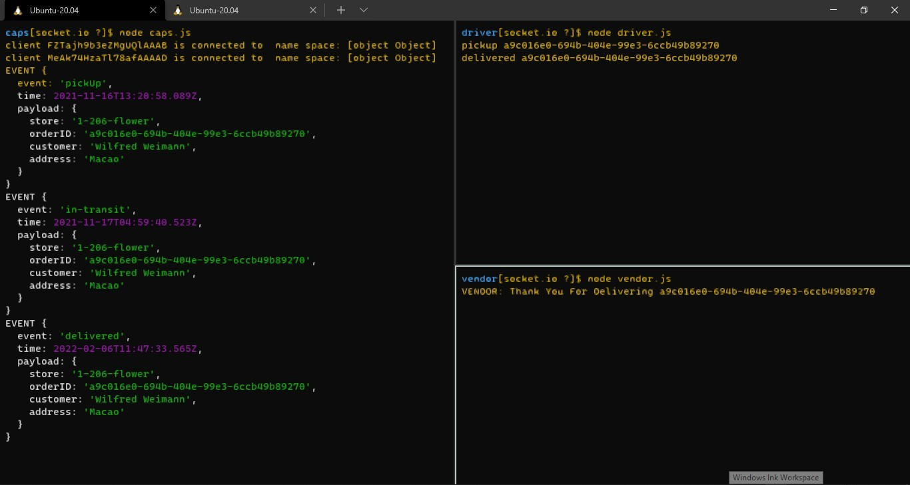
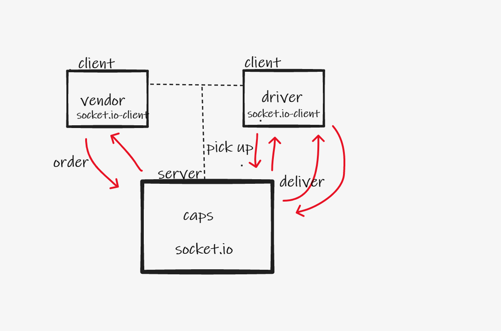

# socket.io

## description: 
- a delivery notification system using socket.io; real time notification system.

## features:
- faker
- socket.io
- jest

## Outputs:

## UML:

## test:
- `node caps.js`
- `node driver.js`
- `node vendor.js`
- after close the server and the client:- `npm test`

